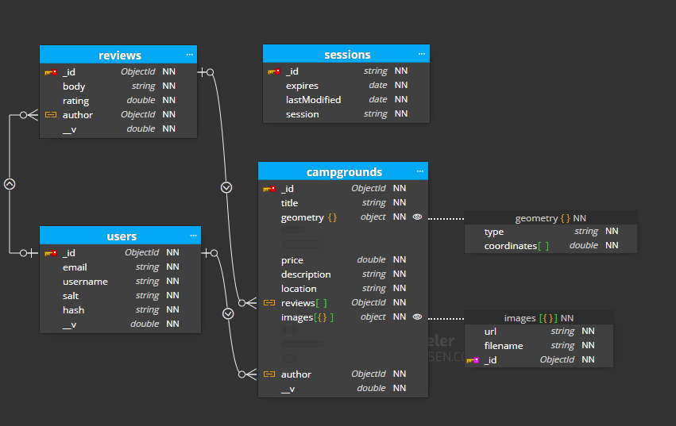
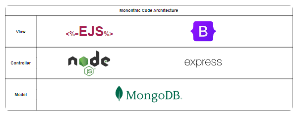

## Full-Stack Campsite Review Web Application (Aug 2024 – Oct 2024)

This is a full-stack web application as part of Colt Steele's Udemy Web Development Bootcamp, providing users with a platform to upload and review campgrounds.

## Website Link (Hosted using Render) 
#(Website takes a while to load if there haven't been any active users)

<https://findcamp-eywj.onrender.com/campgrounds>

## Demo (Created using LICEcap) 

## Functionalities

- **CRUD Functionality:** Managed campgrounds, comments, and reviews with full Create, Read, Update, and Delete (CRUD) capabilities using **Express** and **EJS** templates..
- **Authentication & Authorization:** Integrated **Passport.js** for secure user authentication, enabling login, sign-up, and role-based access control for CRUD operations on campgrounds and reviews. 
- **Cloudinary & Mapbox API Integration:** Utilized **Cloudinary** for image uploads and **Mapbox** for interactive maps displaying campsite locations (including a cluster map).
- **Security Measures:** Implemented **MongoDB Injection** security and **Cross-Site Scripting (XSS)** protection to secure user data and enhance site safety using **Helmet.js**, **sanitize-html.js**, and **dotenv**.
- **Validation:** Incorporated **JOI.js** validation to ensure data integrity across user inputs.

## Technical Details

- **Database Hosting:** Hosted the application’s database on **MongoDB Atlas** for cloud-based, scalable data storage.
- **Deployment:** Deployed the web application using **Render** for seamless and reliable hosting.

## Diagrams
### MongoDB Schema (Created using Luna Modeler)

### Technologies Used
<table border="1" cellpadding="10" cellspacing="0" style="border-collapse: collapse; width: 100%; text-align: center;">
  <thead>
    <tr>
      <th>Frontend</th>
      <th>Backend</th>
      <th>Database</th>
      <th>Development</th>
      <th>Production</th>
    </tr>
  </thead>
  <tbody>
    <tr>
      <td></td>
      <td></td>
      <td></td>
      <td></td>
      <td></td>
    </tr>
    <tr>
      <td></td>
      <td></td>
      <td></td>
      <td></td>
      <td></td>
    </tr>
    <tr>
      <td></td>
      <td></td>
      <td></td>
      <td></td>
      <td></td>
    </tr>
    <tr>
      <td></td>
      <td></td>
      <td></td>
      <td></td>
      <td></td>
    </tr>
  </tbody>
</table>

### Code Architecture (MVC architecture)

## Understanding the MVC Architecture Used in This Project

For this project, I employed a **Model-View-Controller (MVC) architecture**, which is a design pattern that separates concerns across three core components:

1. **Model**:  
   The Model manages the **data and business logic** of the application. It represents the core data structures, handles database operations, and ensures data consistency. In this project, the Model interacts with the database to store, retrieve, and update information used throughout the application.

2. **View**:  
   The View is responsible for rendering the **user interface**. It presents the data from the Model in a structured format that users can interact with, typically through HTML templates and CSS styling. This project’s Views handle the layout of pages and render dynamic content based on the Model’s data.

3. **Controller**:  
   The Controller acts as an intermediary, managing the **flow of data** between the Model and the View. It processes user inputs (like form submissions), performs necessary operations through the Model, and updates the View accordingly.

---

### Why Use an MVC Monolithic Architecture?

The **MVC architecture** was chosen because it offers a straightforward and intuitive way to build full-stack applications, making it ideal for learning purposes. It allows a clear separation of responsibilities, helping developers understand the interactions between data, user interfaces, and backend logic. By following this pattern, the project simulates the structure of real-world web applications.

---

## Production System Cost

- **Render Hobby Tier**: Free  
- **MongoDB Atlas Shared Plan (M0 Cluster Tier)**: Free  
- **Cloudinary**: Free  
- **GitHub**: Free

## Lessons Learned

- Gained more experience with **Express.js**  
- Introduction to **MongoDB** database design  
- Improved skills with **Bootstrap** for frontend styling  
- Used **Git** for version control and learned best practices for managing code versions  
- Deployed the application to **Render** and the database to **MongoDB Atlas**  
- Implemented **authentication and authorization** using **Passport.js**  
- Managed dependencies and scripts efficiently using **npm** (Node Package Manager)  
- Gained more experience integrating **APIs** such as **Cloudinary** for image uploads and **Mapbox** for interactive maps  
- Addressed potential security issues using **helmet.js** and **sanitize-html.js**  
